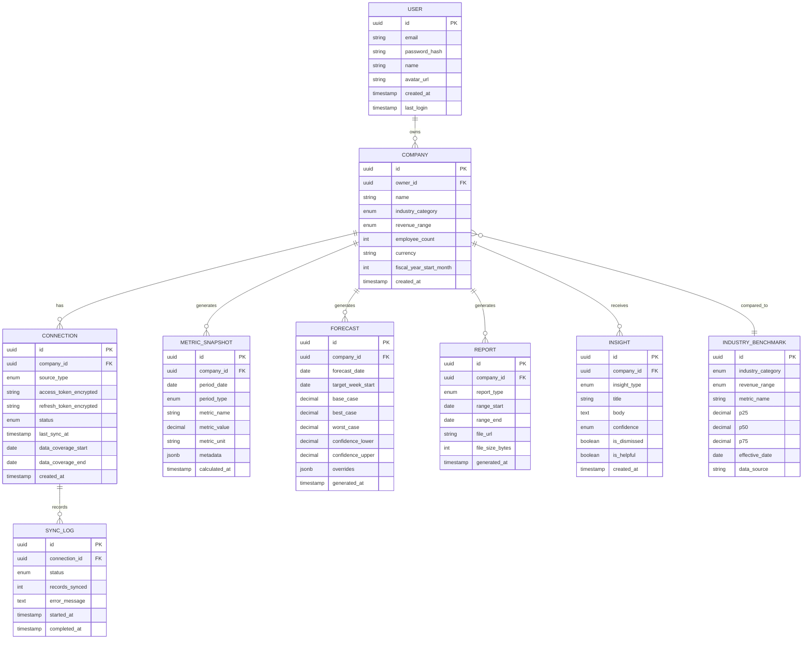

# FinancialIntelAI — Product Requirements Document (PRD)

> **Product:** FinancialIntelAI — The CFO-in-a-Box for Growing Businesses
> **Version:** 1.0 — MVP Release
> **Date:** June 7, 2026
> **Owner:** Product Team
> **Status:** Draft — Awaiting Engineering Review

---

## Table of Contents

1. [Product Overview](#1-product-overview)
2. [User Personas](#2-user-personas)
3. [Features](#3-features)
4. [User Journeys](#4-user-journeys)
5. [Dashboard Requirements](#5-dashboard-requirements)
6. [Forecasting Requirements](#6-forecasting-requirements)
7. [Reporting Requirements](#7-reporting-requirements)
8. [Non-Functional Requirements](#8-non-functional-requirements)
9. [Data Architecture](#9-data-architecture)
10. [Release Criteria](#10-release-criteria)
11. [Appendices](#11-appendices)

---

## 1. Product Overview

### 1.1 Vision

FinancialIntelAI transforms how DTC and e-commerce brands ($1M–$20M revenue) understand and act on their financial data. By connecting existing tools (Shopify, QuickBooks, Stripe), we automatically generate KPI dashboards, cash flow forecasts, industry benchmarks, and AI-driven insights — replacing spreadsheets with a living, intelligent financial command center.

### 1.2 Problem Statement

DTC founders making $1M–$20M in revenue face five critical financial pain points:

| # | Pain Point | Current Workaround | Cost of Inaction |
|---|---|---|---|
| 1 | **Unpredictable cash flow** — inventory buys, ad cycles, and seasonality create constant crunches | Manual spreadsheet projections updated monthly | Cash shortfalls, missed purchase windows, emergency financing at bad terms |
| 2 | **No benchmarking data** — founders can't tell if a 22% gross margin is good or terrible for their category | Asking peers in Slack groups, Googling outdated reports | Over-investing in wrong areas, false confidence in weak metrics |
| 3 | **Spreadsheet hell** — the finance "stack" is fragile, manual, and error-prone | Part-time bookkeeper maintaining Google Sheets | Stale data, formula errors, 10+ hours/month wasted on reporting |
| 4 | **Decision paralysis** — no financial models to evaluate hiring, inventory, or channel expansion | Gut feeling, anecdote from a podcast | $10K–$100K+ lost on bad bets (overstocking, premature hires) |
| 5 | **Investor unreadiness** — scramble to assemble financials for fundraising or lending | Panic-mode report building over 2–3 weeks | Weaker negotiating position, delayed rounds, lost deals |

### 1.3 Success Metrics

| Metric | Definition | MVP Target (Day 90) |
|---|---|---|
| **Activation Rate** | % of signups that connect ≥ 1 data source within 1 hour | ≥ 75% |
| **Time to Value** | Time from signup to first dashboard view | ≤ 5 minutes |
| **Weekly Active Usage** | % of paid users returning ≥ 3 days/week | ≥ 40% |
| **Trial-to-Paid Conversion** | % of free trial users converting to paid | ≥ 22% |
| **Net Promoter Score** | User satisfaction survey | ≥ 50 |
| **Monthly Churn** | % of paid users cancelling per month | ≤ 5% |
| **Feature Adoption** | % of users using benchmarking within 7 days | ≥ 60% |

### 1.4 Scope

| In Scope (MVP) | Out of Scope (Post-MVP) |
|---|---|
| Shopify, QuickBooks Online, Stripe integrations | Xero, Amazon, WooCommerce, custom API |
| 15 core KPIs across 5 categories | 40+ advanced KPIs, custom KPIs |
| 3-month cash flow forecast | 12–24 month revenue forecasting |
| Industry benchmarking (broad category + stage) | Custom peer group benchmarking |
| AI insight cards + weekly email digest | Real-time alerts, strategic playbooks |
| PDF + CSV reports | Investor data rooms, board packs |
| Single-user accounts | Multi-user teams, advisor seats |
| Web application (responsive) | Native mobile apps |
| English language | Multi-language, multi-currency |

---

## 2. User Personas

### 2.1 Primary Persona: "Scaling Sarah" — DTC Founder/CEO

```
┌──────────────────────────────────────────────────────────────────────┐
│  PERSONA: SCALING SARAH                                              │
│  ─────────────────────────────────────────────────────────────────── │
│                                                                      │
│  Role:          Founder & CEO                                        │
│  Company:       Glow & Grow (DTC skincare brand)                     │
│  Revenue:       $2.8M annually                                       │
│  Employees:     12 (warehouse, marketing, ops)                       │
│  Funding:       Bootstrapped, considering Seed round                 │
│  Location:      Austin, TX                                           │
│  Age:           34                                                   │
│  Education:     BA in Marketing (non-finance background)             │
│                                                                      │
└──────────────────────────────────────────────────────────────────────┘
```

| Attribute | Detail |
|---|---|
| **Tech Stack** | Shopify Plus, QuickBooks Online, Stripe, Klaviyo, Meta Ads |
| **Finance Setup** | Part-time bookkeeper (10 hrs/week), Google Sheets for projections |
| **Daily Routine** | Checks Shopify dashboard 3x/day; reviews ad spend in Meta; manual cash balance check in QBO weekly |
| **Goals** | Scale to $5M in 18 months; potentially raise a Seed round; hire a marketing director |
| **Frustrations** | "I spend my Sunday nights updating spreadsheets instead of strategizing." / "I have no idea if my margins are good for skincare at my stage." / "My bookkeeper gives me last month's P&L on the 15th — that's ancient history." |
| **Buying Trigger** | End-of-quarter review revealed she's been unprofitable for 2 months without realizing it |
| **Decision Process** | Solo decision-maker; will try a free trial before committing; trusts peer recommendations in DTC communities |
| **Willingness to Pay** | $99–$299/mo — less than the cost of 2 hours of a fractional CFO |

**Jobs to Be Done:**
1. *"Help me know if my business is financially healthy right now — without waiting for my bookkeeper."*
2. *"Show me how I compare to other skincare brands at my revenue stage."*
3. *"Tell me if I can afford to hire someone next quarter without running out of cash."*
4. *"Give me investor-ready financials when I'm ready to fundraise."*

---

### 2.2 Secondary Persona: "Operator Omar" — Head of Operations / COO

```
┌──────────────────────────────────────────────────────────────────────┐
│  PERSONA: OPERATOR OMAR                                              │
│  ─────────────────────────────────────────────────────────────────── │
│                                                                      │
│  Role:          Head of Operations / COO                             │
│  Company:       ThreadCraft (DTC apparel, $7M revenue)               │
│  Employees:     35                                                   │
│  Funding:       Series A ($2M raised)                                │
│  Location:      Brooklyn, NY                                         │
│  Age:           38                                                   │
│  Education:     MBA                                                  │
│                                                                      │
└──────────────────────────────────────────────────────────────────────┘
```

| Attribute | Detail |
|---|---|
| **Tech Stack** | Shopify Plus, NetSuite (considering switch from QBO), Stripe, ShipStation |
| **Finance Setup** | Full-time bookkeeper, fractional CFO (5 hrs/month), Google Sheets + Looker for dashboards |
| **Daily Routine** | Morning KPI review with founder; weekly ops meetings with financials; monthly board reporting |
| **Goals** | Improve unit economics to hit profitability by Q4; optimize inventory turns; prepare for Series B |
| **Frustrations** | "Our fractional CFO gives us great advice but only 5 hours a month — I need continuous visibility." / "Building board reports takes 2 full days every month." / "I need scenario planning: what if COGS goes up 10%? What if we launch in a new channel?" |
| **Buying Trigger** | Board asked for standardized financial reporting and benchmarks; current Looker dashboards are marketing-only |
| **Decision Process** | Recommends to CEO; needs to justify ROI; will want a demo and a pilot period |
| **Willingness to Pay** | $299–$699/mo — replaces partial CFO cost and Looker maintenance |

**Jobs to Be Done:**
1. *"Give me a single pane of glass for all financial KPIs — I'm tired of tabbing between 6 tools."*
2. *"Automate the board report so I get 2 days of my life back each month."*
3. *"Let me model scenarios: What happens to cash if we increase inventory 30% for holiday season?"*
4. *"Show me where we're bleeding money compared to industry peers."*

---

### 2.3 Tertiary Persona: "Bookkeeper Beth" — External Bookkeeper / Part-Time CFO

```
┌──────────────────────────────────────────────────────────────────────┐
│  PERSONA: BOOKKEEPER BETH                                            │
│  ─────────────────────────────────────────────────────────────────── │
│                                                                      │
│  Role:          Freelance Bookkeeper / Part-time CFO                 │
│  Clients:       8 DTC brands ($500K–$10M each)                       │
│  Location:      Remote (Denver, CO)                                  │
│  Age:           42                                                   │
│  Education:     CPA, 15 years in accounting                          │
│                                                                      │
└──────────────────────────────────────────────────────────────────────┘
```

| Attribute | Detail |
|---|---|
| **Tech Stack** | QuickBooks Online (primary), Xero (2 clients), Excel, Gusto |
| **Daily Routine** | Reconcile accounts, categorize transactions, prepare monthly P&L, answer client questions via email |
| **Goals** | Deliver more strategic value to retain clients; reduce time on repetitive reporting; become a trusted advisor, not just a "data entry person" |
| **Frustrations** | "I spend 60% of my time on reconciliation and reporting that a tool could automate." / "My clients ask me 'how are we doing?' and I can only answer based on last month's data." / "I want to offer benchmarking and forecasting but I don't have the tools or data." |
| **Buying Trigger** | A client asks her to recommend a financial dashboard; she wants to white-label it |
| **Decision Process** | Evaluates tools that serve multiple clients; needs multi-company support; will recommend to clients if it makes her look good |
| **Willingness to Pay** | Advisor seat at $29/seat/mo per client; or recommends Growth tier ($299/mo) to clients |

**Jobs to Be Done:**
1. *"Let me see all my clients' financial health in one view."*
2. *"Auto-generate the monthly reports I currently build by hand in Excel."*
3. *"Give me benchmarks so I can proactively advise clients, not just report history."*
4. *"Make me look like a strategic advisor, not a number cruncher."*

---

### 2.4 Edge Persona: "Investor Ian" — Angel Investor / Advisor (Read-Only)

```
┌──────────────────────────────────────────────────────────────────────┐
│  PERSONA: INVESTOR IAN                                               │
│  ─────────────────────────────────────────────────────────────────── │
│                                                                      │
│  Role:          Angel investor / Board advisor                       │
│  Portfolio:     12 DTC brands                                        │
│  Location:      San Francisco, CA                                    │
│  Age:           48                                                   │
│                                                                      │
└──────────────────────────────────────────────────────────────────────┘
```

| Attribute | Detail |
|---|---|
| **Needs** | Quick portfolio health view; standardized metrics across companies; red flag alerts |
| **Frustrations** | "Every founder sends me financials in a different format — some in Google Sheets, some as screenshots." |
| **Interaction** | Read-only access; views shared dashboards and reports; does not configure anything |
| **Willingness to Pay** | $0 (advisor seat paid for by the portfolio company) |

**Jobs to Be Done:**
1. *"Show me which of my portfolio companies are trending up or down — in 30 seconds."*
2. *"Give me standardized metrics I can compare across all my DTC investments."*

---

### 2.5 Persona Priority Matrix

| Persona | Priority | MVP Access | Tier Target | Key Feature Focus |
|---|---|---|---|---|
| **Scaling Sarah** | 🔴 P0 — Core | Full access | Starter / Growth | Dashboard, Benchmarking, Cash Forecast |
| **Operator Omar** | 🟠 P1 — Important | Full access | Growth / Scale | Scenarios, Board Reports, Advanced KPIs |
| **Bookkeeper Beth** | 🟡 P2 — Secondary | Advisor seat | Growth (client) | Multi-client view, Auto-reports |
| **Investor Ian** | ⚪ P3 — Post-MVP | Read-only link | Add-on seat | Portfolio dashboard, Shared reports |

---

## 3. Features

### 3.1 Feature Overview Map

```
┌─────────────────────────────────────────────────────────────────────────┐
│                        FINANCIALINTELAI FEATURES                        │
├─────────────────────────────────────────────────────────────────────────┤
│                                                                         │
│  FOUNDATION LAYER                                                       │
│  ┌─────────────────┐  ┌──────────────────┐  ┌───────────────────────┐  │
│  │ F1: Auth &      │  │ F2: Data         │  │ F3: Onboarding       │  │
│  │ Account Mgmt    │  │ Integrations     │  │ Wizard               │  │
│  └─────────────────┘  └──────────────────┘  └───────────────────────┘  │
│                                                                         │
│  CORE PRODUCT LAYER                                                     │
│  ┌─────────────────┐  ┌──────────────────┐  ┌───────────────────────┐  │
│  │ F4: KPI         │  │ F5: Industry     │  │ F6: Cash Flow        │  │
│  │ Dashboard       │  │ Benchmarking     │  │ Forecasting          │  │
│  └─────────────────┘  └──────────────────┘  └───────────────────────┘  │
│                                                                         │
│  INTELLIGENCE LAYER                                                     │
│  ┌─────────────────┐  ┌──────────────────┐  ┌───────────────────────┐  │
│  │ F7: AI-Powered  │  │ F8: Reports &    │  │ F9: Alerts &         │  │
│  │ Insights        │  │ Export           │  │ Notifications        │  │
│  └─────────────────┘  └──────────────────┘  └───────────────────────┘  │
│                                                                         │
│  PLATFORM LAYER                                                         │
│  ┌─────────────────┐  ┌──────────────────┐  ┌───────────────────────┐  │
│  │ F10: Settings & │  │ F11: Billing &   │  │ F12: Free Tools      │  │
│  │ Company Profile │  │ Subscription     │  │ (PLG)                │  │
│  └─────────────────┘  └──────────────────┘  └───────────────────────┘  │
│                                                                         │
└─────────────────────────────────────────────────────────────────────────┘
```

### 3.2 Feature Specifications

---

#### F1: Authentication & Account Management

| Attribute | Specification |
|---|---|
| **Priority** | P0 — Required for MVP |
| **Persona** | All |
| **Description** | Secure user registration, login, and account management |

**Functional Requirements:**

| ID | Requirement | Acceptance Criteria |
|---|---|---|
| F1.1 | Email + password registration | User can create account with email, password, and company name. Email verification sent within 30 seconds. |
| F1.2 | Social login (Google) | User can register/login via Google OAuth. Account merges correctly if email already exists. |
| F1.3 | Magic link login | User can request a passwordless login link. Link expires after 15 minutes. |
| F1.4 | Password reset | User can reset password via email link. Old sessions invalidated on reset. |
| F1.5 | Session management | Sessions persist for 30 days with refresh tokens. "Remember me" option available. |
| F1.6 | Account deletion | User can request account deletion. All data purged within 72 hours. Confirmation email sent. |
| F1.7 | Profile management | User can update name, email, avatar, and company name from settings. |

---

#### F2: Data Integrations

| Attribute | Specification |
|---|---|
| **Priority** | P0 — Required for MVP |
| **Persona** | Scaling Sarah, Operator Omar |
| **Description** | Connect third-party data sources via OAuth to automatically ingest financial data |

**Functional Requirements:**

| ID | Requirement | Acceptance Criteria |
|---|---|---|
| F2.1 | Shopify integration | OAuth connection to Shopify store. Ingests: orders, revenue, refunds, COGS, products. Historical data pulled for up to 12 months. |
| F2.2 | QuickBooks Online integration | OAuth connection to QBO. Ingests: P&L, balance sheet, cash flow statement, chart of accounts, transactions. Historical data for up to 12 months. |
| F2.3 | Stripe integration | OAuth connection to Stripe. Ingests: payments, payouts, refunds, disputes, subscriptions (if applicable). Historical data for up to 12 months. |
| F2.4 | Data normalization | All ingested data mapped to a unified internal schema. Revenue from Shopify + Stripe deduplicated (avoid double-counting). |
| F2.5 | Initial sync | First data sync completes within 60 seconds for < 12 months of data. Progress bar shown during sync. |
| F2.6 | Daily auto-sync | Background sync runs daily at 2:00 AM user's local time. User notified if sync fails. |
| F2.7 | Manual refresh | "Refresh Data" button triggers on-demand sync. Throttled to 1 manual refresh per 15 minutes. |
| F2.8 | Connection status | Integration settings page shows: connection status (🟢 Connected / 🔴 Error), last sync time, data coverage dates. |
| F2.9 | Disconnect flow | User can disconnect any integration. Confirmation modal: "This will remove synced data. Are you sure?" Data removed within 5 minutes. |
| F2.10 | Error handling | If OAuth token expires, show banner: "Your [Source] connection needs re-authorization." One-click re-auth flow. |

**Data Mapping Schema (per source):**

| Source | Data Entities | Sync Fields |
|---|---|---|
| **Shopify** | Orders, Refunds, Products | `order_id`, `created_at`, `total_price`, `subtotal`, `total_tax`, `total_discounts`, `financial_status`, `line_items[]`, `refund_amount` |
| **QuickBooks** | Profit & Loss, Balance Sheet, Transactions | `account_name`, `account_type`, `amount`, `date`, `category`, `vendor`, `customer` |
| **Stripe** | Charges, Payouts, Refunds | `charge_id`, `amount`, `currency`, `created`, `status`, `refund_amount`, `payout_amount`, `payout_arrival_date` |

---

#### F3: Onboarding Wizard

| Attribute | Specification |
|---|---|
| **Priority** | P0 — Required for MVP |
| **Persona** | Scaling Sarah (primary) |
| **Description** | Guided 3-step onboarding to get users to first value in < 5 minutes |

**Functional Requirements:**

| ID | Requirement | Acceptance Criteria |
|---|---|---|
| F3.1 | Step 1: Company Profile | User enters: company name, industry category (dropdown: Apparel, Beauty, Food & Beverage, Health & Wellness, Home, Electronics, Other), annual revenue range (dropdown: $500K–$1M, $1M–$3M, $3M–$5M, $5M–$10M, $10M–$20M, $20M+), employee count. |
| F3.2 | Step 2: Connect Data | Show 3 integration tiles (Shopify, QuickBooks, Stripe) with "Connect" buttons. Minimum 1 connection required to proceed. Show skip option with warning: "You'll see limited data without all connections." |
| F3.3 | Step 3: Your Dashboard | After sync completes, auto-redirect to dashboard. Show guided tour overlay (5 tooltips highlighting: KPIs, Trends, Benchmarks, Forecast, Insights). Tour can be dismissed or replayed from settings. |
| F3.4 | Progress indicator | Show step progress (1/3, 2/3, 3/3) with completion percentage. |
| F3.5 | Skip & resume | If user exits during onboarding, resume from last completed step on next login. Show "Complete Setup" banner until done. |
| F3.6 | Empty states | If no data source connected, dashboard shows meaningful empty states with CTAs: "Connect Shopify to see your revenue metrics →" |

---

#### F4: KPI Dashboard

> *Full specification in [Section 5: Dashboard Requirements](#5-dashboard-requirements)*

| Attribute | Specification |
|---|---|
| **Priority** | P0 — Required for MVP |
| **Persona** | All |
| **Description** | Real-time financial health overview with 15 core KPIs, visualizations, and trend indicators |

---

#### F5: Industry Benchmarking

| Attribute | Specification |
|---|---|
| **Priority** | P0 — Required for MVP |
| **Persona** | Scaling Sarah, Operator Omar |
| **Description** | Compare user's KPIs against industry peers by category and revenue stage |

**Functional Requirements:**

| ID | Requirement | Acceptance Criteria |
|---|---|---|
| F5.1 | Benchmark data source | MVP: Curated public benchmark dataset (NYU Stern, industry reports, SBA data). Post-MVP: Aggregated anonymized user data. |
| F5.2 | Comparison dimensions | Benchmarks segmented by: (1) Industry category (Apparel, Beauty, Food, etc.) and (2) Revenue stage ($1M–$3M, $3M–$5M, $5M–$10M, $10M–$20M). |
| F5.3 | Percentile ranking | Each KPI displays user's percentile rank: "Your gross margin of 42% is in the **72nd percentile** for Beauty brands at $1M–$3M." |
| F5.4 | Visual representation | Horizontal bar showing 25th, 50th, 75th percentile with user's position marked. Color-coded: Red (< 25th), Yellow (25th–50th), Green (> 50th). |
| F5.5 | Benchmark overlay on dashboard | Toggle button on KPI dashboard: "Show Benchmarks" — overlays benchmark ranges on each metric card. |
| F5.6 | Benchmark detail page | Dedicated `/benchmarks` page showing all KPIs with full benchmark comparison, category/stage selector, and explanatory text for each metric. |
| F5.7 | Data freshness indicator | Show "Benchmarks last updated: [date]" footer. MVP target: update benchmarks quarterly. |
| F5.8 | Benchmark KPIs covered | Gross Margin %, Net Margin %, CAC, LTV, LTV:CAC, AOV, Revenue Growth Rate (MoM), Refund Rate, Burn Rate. (9 of 15 KPIs have benchmarks). |

---

#### F6: Cash Flow Forecasting

> *Full specification in [Section 6: Forecasting Requirements](#6-forecasting-requirements)*

| Attribute | Specification |
|---|---|
| **Priority** | P0 — Required for MVP |
| **Persona** | Scaling Sarah, Operator Omar |
| **Description** | 3-month cash flow projection with scenario modeling and manual overrides |

---

#### F7: AI-Powered Financial Insights

| Attribute | Specification |
|---|---|
| **Priority** | P1 — Required for MVP |
| **Persona** | Scaling Sarah (primary) |
| **Description** | LLM-generated analysis of financial data patterns, delivered as insight cards and email digests |

**Functional Requirements:**

| ID | Requirement | Acceptance Criteria |
|---|---|---|
| F7.1 | Insight generation | System generates 3–5 insights per week based on financial data. Insights are generated every Monday at 8:00 AM user's local time. |
| F7.2 | Insight types | **Anomaly Detection:** "Your COGS jumped 18% this week — shipping costs were the primary driver." / **Trend Analysis:** "Revenue has grown 4 consecutive months at 8% MoM — on track for $3.4M annualized." / **Benchmark Comparison:** "Your CAC is 2.1x the industry median. Consider testing organic channels." / **Predictive Warning:** "At current burn rate, cash runway drops below 3 months by [date]." / **Opportunity Identification:** "Your AOV increased 12% after the product bundle launch — consider expanding bundles." |
| F7.3 | Insight cards UI | In-app cards displayed on dashboard sidebar. Each card has: title, 2–3 sentence explanation, relevant metric highlighted, "Learn more" expandable detail, "Dismiss" action, "Helpful / Not helpful" feedback buttons. |
| F7.4 | Weekly email digest | HTML email sent every Monday at 8:00 AM with: top 3 insights of the week, key KPI summary (this week vs. last), cash runway status, CTA button to open full dashboard. |
| F7.5 | Insight quality controls | Insights must reference specific numbers from the user's data. No generic advice ("consider cutting costs"). Each insight includes a confidence indicator (High / Medium). Insights are deduplicated — same insight not shown within 30 days. |
| F7.6 | Insight history | `/insights` page shows chronological feed of all past insights. Filterable by type (Anomaly, Trend, Benchmark, Predictive, Opportunity). |
| F7.7 | LLM guardrails | Insights never provide tax, legal, or investment advice. Disclaimer footer: "AI-generated insights for informational purposes. Consult a financial advisor for specific guidance." |

---

#### F8: Reports & Export

> *Full specification in [Section 7: Reporting Requirements](#7-reporting-requirements)*

| Attribute | Specification |
|---|---|
| **Priority** | P1 — Required for MVP |
| **Persona** | Scaling Sarah, Bookkeeper Beth |
| **Description** | Automated report generation and data export in PDF and CSV formats |

---

#### F9: Alerts & Notifications

| Attribute | Specification |
|---|---|
| **Priority** | P2 — Post-MVP Enhancement |
| **Persona** | All |
| **Description** | Configurable threshold-based alerts for KPI deviations |

**Functional Requirements (Post-MVP):**

| ID | Requirement | Acceptance Criteria |
|---|---|---|
| F9.1 | Threshold alerts | User can set custom thresholds for any KPI: "Alert me if gross margin drops below 35%." |
| F9.2 | Delivery channels | Alerts delivered via: in-app notification bell, email, Slack webhook (optional). |
| F9.3 | Default alerts (MVP) | Pre-configured, non-customizable alerts for: Cash runway < 3 months (🔴), Revenue decline > 10% MoM (🟡), Integration sync failure (🔴). Delivered via email only. |
| F9.4 | Alert management | Settings page to view, edit, enable/disable, and delete alert rules. |

---

#### F10: Settings & Company Profile

| Attribute | Specification |
|---|---|
| **Priority** | P0 — Required for MVP |
| **Persona** | All |
| **Description** | Configuration for company profile, integrations, preferences, and account management |

**Functional Requirements:**

| ID | Requirement | Acceptance Criteria |
|---|---|---|
| F10.1 | Company profile | Edit: company name, industry category, revenue range, employee count, fiscal year start month, currency (USD only for MVP). |
| F10.2 | Integration management | View all connected integrations. Connect/disconnect. See sync status and history. |
| F10.3 | Notification preferences | Toggle email digest on/off. Set preferred digest day (default: Monday). |
| F10.4 | Data management | Download all data (CSV). Request data deletion. View data retention period. |
| F10.5 | Display preferences | Date format (MM/DD/YYYY, DD/MM/YYYY). Number format (1,000.00 vs 1.000,00). Dark mode / Light mode toggle. |

---

#### F11: Billing & Subscription

| Attribute | Specification |
|---|---|
| **Priority** | P0 — Required for MVP |
| **Persona** | Scaling Sarah, Operator Omar |
| **Description** | Stripe-powered subscription management with 14-day free trial |

**Functional Requirements:**

| ID | Requirement | Acceptance Criteria |
|---|---|---|
| F11.1 | Free trial | 14-day free trial with full Starter tier access. No credit card required for trial. Trial countdown shown in top banner. |
| F11.2 | Plan selection | Pricing page showing Starter ($99/mo), Growth ($299/mo), Scale ($699/mo). Monthly/annual toggle with annual savings highlighted. |
| F11.3 | Checkout | Stripe Checkout for payment. Accepts credit/debit cards. |
| F11.4 | Plan management | Upgrade/downgrade from settings. Upgrades take effect immediately (prorated). Downgrades take effect at next billing cycle. |
| F11.5 | Cancellation | Cancel subscription from settings. Service continues until end of billing period. Exit survey (optional, 1 question: "Why are you leaving?"). |
| F11.6 | Invoice history | View and download past invoices from billing settings. |
| F11.7 | Trial expiry | 3 days before trial ends: email reminder. On expiry: show upgrade modal. After trial: dashboard becomes read-only (no data refresh). |

---

#### F12: Free Tools (Product-Led Growth)

| Attribute | Specification |
|---|---|
| **Priority** | P2 — Nice to Have for MVP |
| **Persona** | Prospective users (top-of-funnel) |
| **Description** | Ungated micro-tools that provide value and capture leads |

**Functional Requirements:**

| ID | Requirement | Acceptance Criteria |
|---|---|---|
| F12.1 | Benchmark Checker | Public page at `/tools/benchmark-checker`. User enters: industry category, revenue range, gross margin %, CAC, AOV. Returns: letter grade (A–F) per metric with percentile ranking. Requires email to see full results. |
| F12.2 | Cash Runway Calculator | Public page at `/tools/cash-runway`. User enters: current cash, monthly revenue, monthly expenses. Returns: runway in months, burn rate visualization, break-even projection. Shareable result link. |
| F12.3 | KPI Scorecard | Public page at `/tools/kpi-scorecard`. User enters 5 financial numbers. Returns: overall health score (0–100), category-level grades, top 3 recommendations. CTA: "See your live dashboard — start free trial." |
| F12.4 | Lead capture | Email captured on all tools (required for full results). Opt-in checkbox for email nurture sequence. Data stored for CRM integration. |

---

## 4. User Journeys

### 4.1 Journey 1: First-Time User — Signup to Aha Moment

> **Persona:** Scaling Sarah
> **Goal:** See her financial dashboard for the first time
> **Success Metric:** Time to value ≤ 5 minutes

```
                            FIRST-TIME USER JOURNEY
    ┌─────────────────────────────────────────────────────────────────┐
    │                                                                 │
    │  ┌──────────┐    ┌──────────┐    ┌──────────┐    ┌──────────┐  │
    │  │ Landing  │───▶│ Sign Up  │───▶│ Onboard  │───▶│ Dashboard│  │
    │  │ Page     │    │          │    │ Wizard   │    │ (Aha!)   │  │
    │  └──────────┘    └──────────┘    └──────────┘    └──────────┘  │
    │   0:00            0:30            1:00            4:30          │
    │                                                                 │
    └─────────────────────────────────────────────────────────────────┘
```

| Step | Touchpoint | User Action | System Response | Success Criteria |
|---|---|---|---|---|
| 1 | Landing Page | Clicks "Start Free Trial" | Redirect to `/signup` | CTA above fold, < 1s load |
| 2 | Sign Up | Enters email, password, company name (or Google OAuth) | Creates account, sends verification email, redirects to onboarding | Account created in < 2s |
| 3 | Onboarding — Company Profile | Selects industry (Beauty), revenue range ($1M–$3M), enters employee count (12) | Stores profile, personalizes benchmarks, advances to Step 2 | 1 screen, < 30s |
| 4 | Onboarding — Connect Data | Clicks "Connect Shopify", completes OAuth, sees sync progress | Ingests 12 months of Shopify data. Shows progress: "Syncing 3,847 orders..." | Sync completes in < 60s |
| 5 | Onboarding — Optional: Connect QBO | Clicks "Connect QuickBooks" or "Skip for now" | If connected: ingests P&L + balance sheet. If skipped: show what metrics are available vs. locked. | Clear value prop for connecting more |
| 6 | Dashboard — First View | Sees full KPI dashboard populate | Guided tour activates: 5 tooltip bubbles highlighting key areas. First insight card: "Your gross margin is 42%, placing you in the 72nd percentile for Beauty brands. Nice!" | User says "wow" within 10s |
| 7 | Exploration | Clicks on benchmarks tab, explores KPIs, views cash forecast | Smooth transitions, all data renders correctly, tooltips explain jargon | User spends > 3 minutes exploring |
| 8 | Email — Day 1 | Opens "Your dashboard is ready" email | Email contains: 3 headline KPIs, link to dashboard, "Did you know?" factoid about their industry | > 40% open rate target |

**Drop-off Risk Points & Mitigations:**

| Risk Point | Mitigation |
|---|---|
| Sign-up friction (too many fields) | Only 3 fields: email, password, company name. Or Google OAuth (1 click). |
| OAuth confusion / fear | Show security badges ("Bank-level encryption"). Show logos of Shopify/QBO confirming it's official. |
| Slow data sync | Show real-time progress with animated counter. If > 60s, show "Almost there!" messaging. |
| Empty dashboard (no data) | Never show empty charts. If data is limited, show what's available with CTAs for more connections. |
| Guided tour annoyance | Tour is skippable. Max 5 tooltips. "Don't show again" option. |

---

### 4.2 Journey 2: Weekly Check-In — Financial Health Review

> **Persona:** Scaling Sarah
> **Goal:** Understand business health in < 2 minutes on Monday morning
> **Trigger:** Weekly email digest or habit

| Step | Touchpoint | User Action | System Response |
|---|---|---|---|
| 1 | Email Digest (Monday 8 AM) | Opens weekly insight email | Shows: top 3 insights, KPI snapshot vs. last week, cash runway status |
| 2 | Click-through | Clicks "View Full Dashboard" | Opens dashboard at `/dashboard` (auto-logged in via magic link token) |
| 3 | Dashboard Review | Scans KPI cards for red/yellow indicators | Anomalies highlighted with pulsing indicators. Trend arrows show direction. |
| 4 | Drill-down | Clicks on a metric card (e.g., Gross Margin) | Expands to detailed view: time-series chart, benchmark comparison, contributing factors |
| 5 | Read Insight | Reads AI insight card: "Shipping costs increased 18% — your carrier rates may need renegotiating" | Marks insight as "Helpful" → system learns preferences |
| 6 | Cash Forecast | Navigates to Forecast tab, checks runway | Sees 3-month projection, confirms runway > 4 months, feels reassured |
| 7 | Exit | Closes browser | Session maintained for quick return |

---

### 4.3 Journey 3: Fundraising Prep — Investor Readiness

> **Persona:** Scaling Sarah
> **Goal:** Generate investor-ready financials for Seed round pitch
> **Timeline:** 2-week preparation window

| Step | Touchpoint | User Action | System Response |
|---|---|---|---|
| 1 | Trigger | Decides to approach investors | Opens FinancialIntelAI |
| 2 | Report Generation | Navigates to Reports → "Monthly Financial Snapshot" | Generates PDF with: revenue trend, P&L summary, KPI dashboard, benchmarks, forecast |
| 3 | Review | Reviews PDF for accuracy | All numbers reconcile with QuickBooks source data |
| 4 | Customization | Adjusts date range to "Last 12 Months" | Report regenerates with updated range |
| 5 | Benchmark Highlight | Toggles "Include Benchmarks" on report | Report shows percentile rankings: "72nd percentile gross margin in Beauty at $1M–$3M" |
| 6 | Forecast Inclusion | Includes 3-month cash flow forecast | Report adds forecast visualization with scenarios |
| 7 | Export | Downloads PDF + CSV of raw data | Files download immediately, professional formatting |
| 8 | Share | Emails PDF to potential investors | Investor sees polished, data-backed financial story |

---

### 4.4 Journey 4: Cash Crisis — Emergency Insight

> **Persona:** Scaling Sarah
> **Goal:** Understand and respond to a sudden cash flow issue
> **Trigger:** Alert email from system

| Step | Touchpoint | User Action | System Response |
|---|---|---|---|
| 1 | Alert Email | Receives: "⚠️ Cash runway has dropped below 3 months" | Email contains: current cash balance, burn rate, projected zero-cash date, CTA to dashboard |
| 2 | Dashboard | Opens dashboard, sees red indicator on Cash Runway KPI | Card pulsing red, shows: "Runway: 2.7 months (was 4.1 months last week)" |
| 3 | Root Cause | Clicks into Cash Runway detail view | Drilldown shows: $45K inventory purchase + $12K ad spend spike = $57K outflow |
| 4 | Forecast | Opens Cash Flow Forecast | Sees projection dropping to $0 in Week 11. Confidence band widens. |
| 5 | Scenario Modeling | Toggles to "Best Case" scenario: "What if I cut ad spend 50%?" | Forecast updates in real-time: runway extends to 4.8 months |
| 6 | Second Scenario | Adds manual override: "$30K revenue injection from new wholesale partner" | Runway extends to 6.2 months |
| 7 | Insight Card | Reads AI insight: "Your ad spend efficiency (ROAS) has declined 35% over 4 weeks. Consider pausing underperforming campaigns and reinvesting in email marketing." | Actionable, data-backed recommendation |
| 8 | Decision | Decides to cut Meta ad spend 40% and renegotiate carrier contract | Uses FinancialIntelAI data in team meeting to justify decision |

---

### 4.5 Journey 5: Bookkeeper Multi-Client Workflow (Post-MVP)

> **Persona:** Bookkeeper Beth
> **Goal:** Review financial health across 5 client brands in 30 minutes

| Step | Touchpoint | User Action | System Response |
|---|---|---|---|
| 1 | Login | Logs into advisor portal | Sees multi-client dashboard with health scores for all clients |
| 2 | Triage | Sorts clients by health score (worst first) | Client "PureFit Supplements" flagged red: gross margin below 25th percentile |
| 3 | Drill-down | Clicks into PureFit's dashboard | Sees detailed KPIs, benchmarks, insights specific to PureFit |
| 4 | Report Generation | Generates monthly financial snapshot for PureFit | Auto-populated PDF with PureFit's data + benchmarks + insights |
| 5 | Client Communication | Emails report to PureFit founder with note: "Your shipping costs are 2x the industry average — let's discuss renegotiating carriers." | Report makes Beth look like a strategic advisor, not just a bookkeeper |
| 6 | Repeat | Repeats steps 3–5 for remaining clients | Total time: 30 minutes for 5 clients (vs. 5 hours manually) |

---

### 4.6 User Journey Summary

| Journey | Persona | Frequency | Time | Key Feature Touched |
|---|---|---|---|---|
| First-time signup | Sarah | Once | 5 min | Onboarding, Integrations, Dashboard |
| Weekly check-in | Sarah / Omar | Weekly | 2 min | Dashboard, Insights, Email Digest |
| Fundraising prep | Sarah | 1–2x/year | 30 min | Reports, Benchmarks, Forecast |
| Cash crisis response | Sarah / Omar | Ad hoc | 10 min | Alerts, Dashboard, Forecast, Scenarios |
| Multi-client review | Beth | Weekly | 30 min | Multi-client view, Reports |

---

## 5. Dashboard Requirements

### 5.1 Dashboard Layout

```
┌─────────────────────────────────────────────────────────────────────────────┐
│  ┌─────────┐  FinancialIntelAI    [Benchmark Toggle]  [Time Range ▼]  👤   │
│  │ SIDEBAR │                                                               │
│  │─────────│  ┌────────────────────────────────────────────────────────┐   │
│  │ 📊 Dash │  │              SUMMARY STRIP (4 hero metrics)           │   │
│  │ 📈 Fore │  │  ┌──────┐  ┌──────┐  ┌──────┐  ┌──────┐             │   │
│  │ 🏷 Bench│  │  │Revenue│  │Margin│  │ Cash │  │Runway│             │   │
│  │ 💡 Insig│  │  │▲ +12% │  │42.1% │  │$142K │  │4.2mo │             │   │
│  │ 📄 Repo │  │  └──────┘  └──────┘  └──────┘  └──────┘             │   │
│  │ ⚙ Sett │  └────────────────────────────────────────────────────────┘   │
│  │         │                                                               │
│  │         │  ┌───────────────────────┐  ┌───────────────────────────┐    │
│  │         │  │   REVENUE SECTION     │  │   PROFITABILITY SECTION   │    │
│  │         │  │                       │  │                           │    │
│  │         │  │  Revenue Chart        │  │  Margin Chart             │    │
│  │         │  │  ┌─────────────────┐  │  │  ┌─────────────────────┐  │    │
│  │         │  │  │ ~~~ time series │  │  │  │ ~~~ time series     │  │    │
│  │         │  │  └─────────────────┘  │  │  └─────────────────────┘  │    │
│  │         │  │  Metric cards below   │  │  Metric cards below       │    │
│  │         │  └───────────────────────┘  └───────────────────────────┘    │
│  │         │                                                               │
│  │         │  ┌───────────────────────┐  ┌───────────────────────────┐    │
│  │         │  │   CASH SECTION        │  │   EFFICIENCY SECTION      │    │
│  │         │  │                       │  │                           │    │
│  │         │  │  Cash Flow Chart      │  │  CAC / LTV / Ratio       │    │
│  │         │  │  + Runway bar         │  │  + Benchmark gauges      │    │
│  │         │  └───────────────────────┘  └───────────────────────────┘    │
│  │         │                                                               │
│  │         │  ┌────────────────────────────────────────────────────────┐   │
│  │         │  │              AI INSIGHTS FEED (collapsible)            │   │
│  │         │  │  💡 "Your COGS jumped 18%..."     [Helpful] [Dismiss] │   │
│  │         │  │  💡 "Revenue growth streak..."     [Helpful] [Dismiss] │   │
│  │         │  └────────────────────────────────────────────────────────┘   │
│  └─────────┘                                                               │
└─────────────────────────────────────────────────────────────────────────────┘
```

### 5.2 KPI Specifications

#### Revenue KPIs

| KPI | Definition | Calculation | Data Source | Visualization | Benchmark Available |
|---|---|---|---|---|---|
| **Gross Revenue** | Total revenue before deductions | `SUM(order.total_price)` for period | Shopify | Area chart + metric card | ❌ (varies too much by company) |
| **Net Revenue** | Revenue after refunds, discounts, and returns | `Gross Revenue - Refunds - Discounts` | Shopify | Area chart + metric card | ❌ |
| **MoM Growth Rate** | Month-over-month revenue growth percentage | `(Current Month Revenue - Prior Month Revenue) / Prior Month Revenue × 100` | Calculated | Percentage with ▲▼ indicator | ✅ |
| **Revenue per Order** | Average revenue generated per order | `Net Revenue / Total Orders` | Shopify | Metric card with sparkline | ✅ (as AOV) |

#### Profitability KPIs

| KPI | Definition | Calculation | Data Source | Visualization | Benchmark Available |
|---|---|---|---|---|---|
| **Gross Margin %** | Percentage of revenue retained after COGS | `(Net Revenue - COGS) / Net Revenue × 100` | Shopify (COGS) + QBO | Gauge chart + trend line | ✅ |
| **Net Margin %** | Percentage of revenue retained after all expenses | `Net Income / Net Revenue × 100` | QBO (P&L) | Gauge chart + trend line | ✅ |
| **EBITDA** | Earnings before interest, taxes, depreciation, amortization | `Net Income + Interest + Taxes + Depreciation + Amortization` | QBO (P&L) | Bar chart (monthly) | ❌ |

#### Cash KPIs

| KPI | Definition | Calculation | Data Source | Visualization | Benchmark Available |
|---|---|---|---|---|---|
| **Cash Balance** | Current available cash | `Latest balance of Cash & Cash Equivalents accounts` | QBO (Balance Sheet) | Large metric card + sparkline | ❌ |
| **Cash Burn Rate** | Monthly net cash decrease | `(Cash Balance Start of Month - Cash Balance End of Month)`. Negative = burning; Positive = accumulating. | QBO | Bar chart (positive/negative) | ✅ |
| **Runway (months)** | Months until cash reaches zero at current burn rate | `Cash Balance / Average Monthly Burn Rate (trailing 3 months)`. If profitable: "∞ (cash positive)" | Calculated | Progress bar (color-coded) + number. 🟢 > 6mo, 🟡 3–6mo, 🔴 < 3mo | ❌ |

#### Efficiency KPIs

| KPI | Definition | Calculation | Data Source | Visualization | Benchmark Available |
|---|---|---|---|---|---|
| **CAC** | Customer Acquisition Cost | `Total Marketing & Advertising Spend / New Customers Acquired`. MVP: use QBO advertising expense / Shopify new customer count. | QBO + Shopify | Metric card with trend | ✅ |
| **LTV** | Customer Lifetime Value | `AOV × Average Purchase Frequency × Average Customer Lifespan`. MVP simplified: `(Total Revenue / Total Unique Customers) × (Average Repeat Rate × Avg. Months Active)` | Shopify | Metric card with trend | ✅ |
| **LTV:CAC Ratio** | Efficiency of customer acquisition | `LTV / CAC` | Calculated | Gauge chart. 🟢 > 3:1, 🟡 2–3:1, 🔴 < 2:1 | ✅ |

#### Operations KPIs

| KPI | Definition | Calculation | Data Source | Visualization | Benchmark Available |
|---|---|---|---|---|---|
| **Average Order Value (AOV)** | Average revenue per order | `Net Revenue / Number of Orders` | Shopify | Metric card + sparkline | ✅ |
| **Refund Rate** | Percentage of orders refunded | `Number of Refunded Orders / Total Orders × 100` | Shopify | Percentage with trend | ✅ |
| **Revenue per Employee** | Revenue efficiency relative to team size | `Annualized Revenue / Employee Count` | Calculated (employee count from company profile) | Metric card | ❌ |

### 5.3 Dashboard Interaction Requirements

| ID | Requirement | Specification |
|---|---|---|
| D1 | **Time range selector** | Dropdown: "This Month", "Last 3 Months", "Last 6 Months", "Last 12 Months", "Custom Range". Default: "Last 3 Months". Custom range allows date picker with min = earliest synced data. |
| D2 | **Benchmark toggle** | Global toggle button: "Show Benchmarks (ON/OFF)". When ON: each KPI card shows benchmark bar with percentile. When OFF: clean metric-only view. Default: ON for first visit, remembers preference. |
| D3 | **Metric card interaction** | Click on any metric card → expands to detail panel. Detail panel shows: full time-series chart (zoomable), benchmark comparison bar, data source attribution, "How is this calculated?" tooltip. |
| D4 | **Chart interactions** | Hover: show tooltip with exact value + date. Zoom: pinch/scroll to zoom time axis. Pan: drag to pan across time. Export: "Download chart as PNG" button. |
| D5 | **Data freshness** | Header bar shows: "Data last synced: [timestamp]". "Refresh" button to trigger manual sync. If data > 24h old: yellow warning banner. |
| D6 | **Responsive design** | Dashboard must be fully functional at: Desktop (≥ 1280px): full grid layout. Tablet (768–1279px): 2-column grid, sidebar collapses. Mobile (< 768px): single-column stack, horizontal scroll for charts. |
| D7 | **Loading states** | Initial load: skeleton cards with shimmer animation. Data refresh: spinner overlay on affected cards only (not full page). Error state: "Unable to load [metric]. Refresh or check your connection." |
| D8 | **Performance** | Dashboard must render within 2 seconds on a 10 Mbps connection. Charts must render within 500ms after data load. |

### 5.4 Dashboard Visual Design Requirements

| Element | Specification |
|---|---|
| **Color Palette** | Primary: Deep blue (#1E3A5F). Accent: Electric teal (#00D4AA). Positive: Green (#22C55E). Negative: Red (#EF4444). Warning: Amber (#F59E0B). Neutral: Slate (#64748B). Background: #0F172A (dark mode), #F8FAFC (light mode). |
| **Typography** | Headings: Inter (600 weight). Metric values: Inter (700 weight, tabular numerals). Body: Inter (400 weight). Monospace numbers: Jetbrains Mono (for financial figures). |
| **Metric Cards** | Rounded corners (12px). Subtle border (1px, 8% white opacity). Background: glass-morphism (backdrop-blur, slight transparency). Shadow: 0 4px 6px rgba(0,0,0,0.1). Hover: slight elevation + border glow. |
| **Charts** | Library: Recharts or Chart.js. Style: clean, minimal gridlines, rounded line caps. Colors: from palette above. Animation: smooth 500ms ease-in-out on data change. |
| **Trend Indicators** | ▲ Green for positive trends (revenue up, margin up). ▼ Red for negative trends (revenue down, margin down). → Gray for flat (< 1% change). Percentage shown next to arrow. |
| **Health Indicators** | 🟢 Green dot: metric is healthy (≥ 50th percentile or positive trend). 🟡 Yellow dot: metric needs attention (25th–50th percentile). 🔴 Red dot: metric is critical (< 25th percentile or negative threshold). |

---

## 6. Forecasting Requirements

### 6.1 Cash Flow Forecasting Engine

#### Model Specification

| Attribute | Specification |
|---|---|
| **Forecast Horizon** | 3 months (13 weeks), displayed weekly |
| **Model Type** | Hybrid: Time-series decomposition + business rules |
| **Components** | **Trend:** Linear regression on trailing 6-month cash flow. **Seasonality:** Weekly + monthly seasonal patterns extracted from trailing 12 months (if available) or category defaults. **Business Rules:** Known fixed costs (rent, salaries) extrapolated forward. Known variable costs modeled as % of revenue. |
| **Confidence Bands** | 80% confidence interval displayed as shaded area around forecast line. Width based on historical forecast error (MAPE). |
| **Update Frequency** | Re-calculated daily after each data sync. User sees forecast timestamp: "Forecast generated: [date, time]." |
| **Minimum Data Required** | 3 months of connected data for basic forecast. < 3 months: show disclaimer "Limited forecast accuracy — more data improves predictions." |

#### Input Data

| Data Point | Source | Usage |
|---|---|---|
| Historical daily revenue | Shopify + Stripe | Revenue projection baseline |
| Historical daily expenses by category | QuickBooks | Expense projection by category |
| Historical cash balances | QuickBooks | Validation + starting point |
| Order volume trends | Shopify | Volume-based cost projections |
| Refund rates | Shopify | Revenue adjustment |
| Seasonal patterns | Calculated + industry defaults | Seasonal multipliers |

### 6.2 Scenario Modeling

| ID | Requirement | Specification |
|---|---|---|
| SC1 | **Pre-built scenarios** | Three default scenarios calculated automatically: **Best Case:** Revenue at 75th percentile of historical variation, expenses at 25th. **Base Case:** Median revenue and expense trends. **Worst Case:** Revenue at 25th percentile, expenses at 75th. |
| SC2 | **Scenario toggle** | Three-button toggle above forecast chart: [Best Case] [Base Case] [Worst Case]. Default: Base Case. Clicking switches the entire chart + metrics. |
| SC3 | **Manual overrides** | "Add Planned Event" button opens a form: **Event Name:** Text input (e.g., "Holiday inventory purchase"). **Type:** Dropdown [One-time Expense, One-time Revenue, Recurring Expense Change, Recurring Revenue Change]. **Amount:** Currency input. **Date:** Date picker (must be within forecast horizon). **Recurrence:** If recurring: [Weekly / Monthly] + end date. Override appears as an annotation on the forecast chart (vertical line + label). |
| SC4 | **Override impact** | After adding an override, forecast recalculates in < 2 seconds. Show delta: "This event changes your runway from 4.2 months to 3.1 months." |
| SC5 | **Override management** | List of active overrides shown below chart. Each override can be edited, toggled on/off, or deleted. Overrides persist across sessions. |

### 6.3 Forecast Visualization

```
┌──────────────────────────────────────────────────────────────────────────┐
│  CASH FLOW FORECAST                                                      │
│                                                                          │
│  [Best Case]  [■ Base Case]  [Worst Case]    [+ Add Planned Event]       │
│                                                                          │
│  $200K ┤                                                                 │
│        │     ████                                                        │
│  $150K ┤   ██    ██                                                      │
│        │  █        ████                                                  │
│  $100K ┤ █             ░░░░░░░░░░░░░░░░░░░░                    ← Base   │
│        │█                  ░░░░░░░░░░░░░                                 │
│   $50K ┤                        ░░░░░░░░░░░░░░░░               ← Worst  │
│        │                              ░░░░░░░░░                          │
│     $0 ┤─────────────────────────────────────────────────────            │
│        │   W1   W2   W3   W4   W5   W6   W7   W8   W9  W10  W11  W12   │
│        │  ◀── Historical ──▶  ◀──────── Forecast ────────▶               │
│                                                                          │
│  ────────────────────────────────────────────────────────────────         │
│  █ Actual Cash Balance    ░░ Forecast (Base)    ▒▒ Confidence Band       │
│                                                                          │
│  ┌────────────────────────────────────────────────────┐                  │
│  │  Current Cash:  $142,340    │  Runway:  4.2 months │                  │
│  │  Monthly Burn:  $33,890     │  Break-even: N/A     │                  │
│  │  Projected Low: $23,100     │  (at current burn)   │                  │
│  └────────────────────────────────────────────────────┘                  │
│                                                                          │
│  ACTIVE OVERRIDES                                                        │
│  ┌────────────────────────────────────────────┐                          │
│  │ 📦 Holiday Inventory Purchase  │ -$50,000  │ Week 6  │ [Edit] [🗑]  │  │
│  │ 💰 Wholesale Partner Revenue   │ +$30,000  │ Week 8  │ [Edit] [🗑]  │  │
│  └────────────────────────────────────────────┘                          │
│                                                                          │
└──────────────────────────────────────────────────────────────────────────┘
```

### 6.4 Forecasting Functional Requirements

| ID | Requirement | Acceptance Criteria |
|---|---|---|
| FC1 | Forecast page accessible from sidebar navigation (`/forecast`) | Page loads within 2 seconds. Shows forecast chart + summary metrics. |
| FC2 | Forecast auto-generates after first data sync | No manual trigger required. User sees forecast on dashboard within 5 minutes of connecting data. |
| FC3 | Weekly granularity | Forecast shows 13 data points (one per week for 3 months). X-axis labeled by week number or date range. |
| FC4 | Cash balance projection | Y-axis shows projected cash balance (not cash flow). Starting point = current cash balance from QBO. |
| FC5 | Runway calculation | Runway = Current Cash / Avg Monthly Net Burn (trailing 3 months). If net positive cash flow: display "Cash Positive ✅" instead of runway months. |
| FC6 | Forecast accuracy tracking | After each week passes, compare forecast vs. actual. Display MAPE (Mean Absolute Percentage Error) on settings: "Your forecast was 87% accurate last month." |
| FC7 | Seasonality handling | If user has < 12 months data: apply category-level seasonal defaults (e.g., DTC beauty sees 35% lift in Nov–Dec). If ≥ 12 months: extract user-specific seasonal patterns. |
| FC8 | Forecast export | "Download Forecast" button exports: CSV with weekly projections (date, base, best, worst, overrides). Included in PDF reports (Section 7). |

### 6.5 Forecast Quality Requirements

| Quality Metric | Target | Measurement |
|---|---|---|
| **MAPE (1-week ahead)** | ≤ 15% | Compare forecast to actuals after each week |
| **MAPE (4-week ahead)** | ≤ 25% | Compare forecast to actuals after each month |
| **Directional Accuracy** | ≥ 80% | % of weeks where forecast correctly predicts up/down direction |
| **Confidence Band Calibration** | 75–85% of actuals fall within 80% CI | Backtest on historical data |
| **Calculation Time** | ≤ 5 seconds per full recalculation | Server-side performance benchmark |

---

## 7. Reporting Requirements

### 7.1 Report Types

#### Report 1: Monthly Financial Snapshot (PDF)

| Attribute | Specification |
|---|---|
| **Purpose** | Executive summary of the month's financial performance |
| **Audience** | Founder, co-founder, bookkeeper, investor |
| **Generation** | Auto-generated on the 1st of each month for the prior month. Manual generation available for any date range. |
| **Delivery** | In-app download + auto-emailed to account owner |
| **Page Count** | 4–6 pages |

**Report Contents:**

| Page | Section | Content |
|---|---|---|
| 1 | **Cover** | Company name, logo (if uploaded), report period, "Generated by FinancialIntelAI" |
| 2 | **Executive Summary** | 4 hero metrics (Revenue, Margin, Cash, Runway) with MoM change. 3 AI-generated headline insights. Traffic light health summary (🟢🟡🔴). |
| 3 | **Revenue & Profitability** | Revenue time-series chart (current month highlighted). Gross margin and net margin trend (6-month view). Revenue breakdown by source (if multiple channels). |
| 4 | **Cash & Efficiency** | Cash balance trend (6-month view). Burn rate bar chart. CAC, LTV, and LTV:CAC with benchmark comparison. |
| 5 | **Benchmarking Summary** | Table of all benchmarked KPIs with user value, industry median, percentile rank. Bar chart showing percentile positioning. |
| 6 | **Cash Flow Forecast** | 3-month forecast chart (base case). Runway metric. Key assumptions listed. |

**Report Design Requirements:**

| Element | Specification |
|---|---|
| **Format** | PDF/A compliant, A4 / Letter size |
| **Branding** | FinancialIntelAI logo in header. User's company name prominent. Clean, professional design. |
| **Colors** | Match dashboard palette (dark blue, teal, green/red for indicators). High-contrast for readability when printed. |
| **Typography** | Inter font family. Minimum 10pt for body text. |
| **Charts** | Static renders of dashboard charts. High-resolution (300 DPI) for print. |
| **File Size** | ≤ 5 MB per report |

---

#### Report 2: KPI Data Export (CSV)

| Attribute | Specification |
|---|---|
| **Purpose** | Raw data export for further analysis in spreadsheets |
| **Audience** | Bookkeeper, founder, analyst |
| **Generation** | On-demand from Reports page or any dashboard chart |
| **Delivery** | Immediate browser download |

**CSV Export Specifications:**

| Export Type | Columns | Rows |
|---|---|---|
| **Full KPI Export** | `date`, `metric_name`, `metric_value`, `metric_unit`, `category`, `benchmark_median`, `benchmark_percentile` | One row per metric per time period (daily/weekly/monthly based on selection) |
| **Revenue Detail** | `date`, `order_id`, `gross_revenue`, `discounts`, `refunds`, `net_revenue`, `order_count`, `aov` | One row per day |
| **Cash Flow Detail** | `date`, `cash_balance`, `cash_inflow`, `cash_outflow`, `net_cash_flow`, `burn_rate`, `runway_months` | One row per week |
| **Forecast Export** | `week_start_date`, `base_case`, `best_case`, `worst_case`, `confidence_lower`, `confidence_upper`, `overrides_total` | One row per forecast week (13 rows) |

**CSV Format Requirements:**

| Attribute | Specification |
|---|---|
| **Encoding** | UTF-8 with BOM (for Excel compatibility) |
| **Delimiter** | Comma-separated |
| **Date Format** | ISO 8601 (`YYYY-MM-DD`) |
| **Number Format** | No thousands separator. Decimal point (`.`). Currency values as raw numbers (no `$` symbol). |
| **Headers** | Snake_case column names in first row |
| **File Naming** | `{company_name}_{export_type}_{start_date}_to_{end_date}.csv` |

---

### 7.2 Report Scheduling & Automation

| ID | Requirement | Specification |
|---|---|---|
| R1 | **Auto-generated monthly report** | Monthly Financial Snapshot PDF generated automatically on the 1st of each month at 6:00 AM user's time zone, covering the prior calendar month. |
| R2 | **Email delivery** | Report emailed to account owner automatically. Subject: "Your [Month Year] Financial Snapshot is ready — [Company Name]." Email body includes: 3 headline metrics + download link + CTA to open dashboard. |
| R3 | **On-demand generation** | User can generate a report for any custom date range from the Reports page. Generation completes within 30 seconds. |
| R4 | **Report history** | Reports page shows list of all generated reports with: report name, date range, generated date, file size, download button. Reports retained for 12 months (Starter), 24 months (Growth), unlimited (Scale). |
| R5 | **Scheduled reports (Post-MVP)** | User can configure: frequency (weekly/monthly/quarterly), recipients (email addresses), report type. |

### 7.3 Report Page Layout

```
┌──────────────────────────────────────────────────────────────────────────┐
│  REPORTS                                                    [+ Generate] │
│                                                                          │
│  ┌────────────────────────────────────────────────────────────────────┐  │
│  │  QUICK GENERATE                                                    │  │
│  │                                                                    │  │
│  │  Report Type: [Monthly Snapshot ▼]                                 │  │
│  │  Date Range:  [May 1, 2026] → [May 31, 2026]                      │  │
│  │  Include:     ☑ Benchmarks  ☑ Forecast  ☑ AI Insights             │  │
│  │  Format:      [PDF ▼]                                              │  │
│  │                                                                    │  │
│  │  [Generate Report]                                                 │  │
│  └────────────────────────────────────────────────────────────────────┘  │
│                                                                          │
│  RECENT REPORTS                                                          │
│  ┌────────────────────────────────────────────────────────────────────┐  │
│  │  📄 May 2026 Financial Snapshot   │ June 1, 2026 │ 2.3 MB │ [⬇]  │  │
│  │  📄 April 2026 Financial Snapshot │ May 1, 2026  │ 2.1 MB │ [⬇]  │  │
│  │  📄 Custom: Q1 2026 Summary       │ Apr 2, 2026  │ 3.4 MB │ [⬇]  │  │
│  │  📄 March 2026 Financial Snapshot │ Apr 1, 2026  │ 2.0 MB │ [⬇]  │  │
│  └────────────────────────────────────────────────────────────────────┘  │
│                                                                          │
│  EXPORT DATA                                                             │
│  ┌────────────────────────────────────────────────────────────────────┐  │
│  │  Export Type: [Full KPI Export ▼]                                   │  │
│  │  Date Range:  [Jan 1, 2026] → [May 31, 2026]                      │  │
│  │  Granularity: [Monthly ▼]                                          │  │
│  │                                                                    │  │
│  │  [Download CSV]                                                    │  │
│  └────────────────────────────────────────────────────────────────────┘  │
│                                                                          │
└──────────────────────────────────────────────────────────────────────────┘
```

---

## 8. Non-Functional Requirements

### 8.1 Performance

| Metric | Target | Measurement |
|---|---|---|
| **Page Load (Dashboard)** | ≤ 2 seconds (Time to Interactive) | Lighthouse measurement on 10 Mbps |
| **API Response Time (p95)** | ≤ 500ms | Server-side latency monitoring |
| **Data Sync (initial)** | ≤ 60 seconds for 12 months of data | End-to-end from OAuth completion |
| **Data Sync (daily)** | ≤ 30 seconds for incremental delta | Background job duration |
| **Report Generation** | ≤ 30 seconds for 6-page PDF | Server-side generation time |
| **Forecast Calculation** | ≤ 5 seconds | Server-side computation time |
| **Chart Rendering** | ≤ 500ms after data load | Client-side rendering time |
| **Concurrent Users** | 500 simultaneous sessions | Load testing with k6 |

### 8.2 Security

| Requirement | Specification |
|---|---|
| **Encryption in transit** | TLS 1.3 for all connections. HSTS enforced. |
| **Encryption at rest** | AES-256 for all stored financial data. Database-level encryption. |
| **Authentication** | bcrypt password hashing (cost factor 12). Rate limiting: 5 failed login attempts → 15-min lockout. |
| **Authorization** | Role-based access: Owner (full), Advisor (read-only). API endpoints require valid JWT. |
| **OAuth token storage** | Integration tokens encrypted with per-user encryption key. Tokens never logged or exposed in API responses. |
| **Data isolation** | Multi-tenant architecture with strict row-level security. No cross-tenant data leakage. |
| **Compliance** | GDPR: data export + deletion flows. CCPA: opt-out mechanisms. SOC 2 Type I: target within 12 months. |
| **Vulnerability management** | Dependency scanning (Snyk/Dependabot). Quarterly penetration testing (post-MVP). |

### 8.3 Reliability

| Metric | Target |
|---|---|
| **Uptime** | 99.9% (≤ 8.76 hours downtime/year) |
| **RTO (Recovery Time Objective)** | ≤ 1 hour |
| **RPO (Recovery Point Objective)** | ≤ 1 hour (point-in-time database recovery) |
| **Data Sync Reliability** | 99.5% of scheduled syncs complete successfully |
| **Error Budget** | 0.1% of requests may fail (4xx/5xx) |

### 8.4 Scalability

| Dimension | MVP Target | 12-Month Target |
|---|---|---|
| **Registered Users** | 500 | 5,000 |
| **Concurrent Sessions** | 50 | 500 |
| **Data Points Stored** | 5M rows | 100M rows |
| **Integrations per User** | 3 | 10 |
| **Reports Generated/Day** | 50 | 1,000 |

### 8.5 Accessibility

| Requirement | Specification |
|---|---|
| **WCAG Level** | AA compliance |
| **Keyboard Navigation** | All interactive elements reachable and operable via keyboard |
| **Screen Reader** | All charts have aria-labels with data summaries. Metric cards readable by screen readers. |
| **Color Contrast** | Minimum 4.5:1 ratio for text. Charts use pattern fills in addition to color. |
| **Focus Indicators** | Visible focus rings on all interactive elements |

---

## 9. Data Architecture

### 9.1 Entity Relationship Diagram



### 9.2 Data Flow

```
┌──────────────┐     ┌──────────────┐     ┌──────────────┐
│   Shopify    │     │  QuickBooks  │     │    Stripe    │
│   API        │     │  API         │     │    API       │
└──────┬───────┘     └──────┬───────┘     └──────┬───────┘
       │                    │                    │
       ▼                    ▼                    ▼
┌──────────────────────────────────────────────────────────┐
│                  INTEGRATION LAYER                        │
│  ┌──────────┐  ┌──────────────┐  ┌───────────────────┐  │
│  │ OAuth    │  │ Data Fetcher │  │ Normalizer /      │  │
│  │ Manager  │  │ (per source) │  │ Deduplicator      │  │
│  └──────────┘  └──────────────┘  └───────────────────┘  │
└──────────────────────────┬───────────────────────────────┘
                           │
                           ▼
┌──────────────────────────────────────────────────────────┐
│                  DATA STORAGE LAYER                       │
│  ┌──────────────────┐  ┌──────────────────────────────┐  │
│  │  PostgreSQL      │  │  TimescaleDB (hypertables)   │  │
│  │  (Users, Config) │  │  (Metrics, Time-Series)      │  │
│  └──────────────────┘  └──────────────────────────────┘  │
└──────────────────────────┬───────────────────────────────┘
                           │
                           ▼
┌──────────────────────────────────────────────────────────┐
│                  COMPUTATION LAYER                        │
│  ┌──────────┐  ┌──────────────┐  ┌───────────────────┐  │
│  │ KPI      │  │ Forecasting  │  │ Benchmarking      │  │
│  │ Engine   │  │ Engine       │  │ Engine            │  │
│  └──────────┘  └──────────────┘  └───────────────────┘  │
│  ┌──────────────────────────────────────────────────┐    │
│  │ AI Insights Engine (LLM + prompt templates)      │    │
│  └──────────────────────────────────────────────────┘    │
└──────────────────────────┬───────────────────────────────┘
                           │
                           ▼
┌──────────────────────────────────────────────────────────┐
│                  PRESENTATION LAYER                       │
│  ┌──────────┐  ┌──────────────┐  ┌───────────────────┐  │
│  │ REST API │  │ WebSocket    │  │ Email Service     │  │
│  │ (Next.js)│  │ (real-time)  │  │ (Resend/SG)       │  │
│  └──────────┘  └──────────────┘  └───────────────────┘  │
└──────────────────────────────────────────────────────────┘
```

---

## 10. Release Criteria

### 10.1 MVP Launch Checklist

| Category | Criterion | Status |
|---|---|---|
| **Core Features** | | |
| | User can sign up and complete onboarding | ⬜ |
| | Shopify integration connects and syncs data | ⬜ |
| | QuickBooks integration connects and syncs data | ⬜ |
| | Stripe integration connects and syncs data | ⬜ |
| | KPI dashboard renders all 15 metrics | ⬜ |
| | Benchmark comparison displays for 9 KPIs | ⬜ |
| | Cash flow forecast generates 3-month projection | ⬜ |
| | Scenario toggle (best/base/worst) works correctly | ⬜ |
| | Manual overrides update forecast in real-time | ⬜ |
| | AI generates ≥ 3 relevant insights per week | ⬜ |
| | Monthly PDF report generates correctly | ⬜ |
| | CSV export downloads with correct data | ⬜ |
| **Billing** | | |
| | 14-day free trial activates on signup | ⬜ |
| | Stripe Checkout processes payment | ⬜ |
| | Plan upgrade/downgrade works | ⬜ |
| | Cancellation flow works | ⬜ |
| **Quality** | | |
| | Dashboard loads in ≤ 2 seconds | ⬜ |
| | All API endpoints respond in ≤ 500ms (p95) | ⬜ |
| | Zero critical (P0) bugs open | ⬜ |
| | Cross-browser tested (Chrome, Safari, Firefox) | ⬜ |
| | Mobile responsive (≥ 375px width) | ⬜ |
| | WCAG AA compliance verified | ⬜ |
| **Security** | | |
| | TLS enforced on all endpoints | ⬜ |
| | Data encryption at rest verified | ⬜ |
| | OAuth token storage encrypted | ⬜ |
| | Rate limiting active on auth endpoints | ⬜ |
| | Privacy policy and ToS published | ⬜ |
| | Data deletion flow tested | ⬜ |
| **Operations** | | |
| | Error monitoring active (Sentry) | ⬜ |
| | Analytics tracking active (PostHog) | ⬜ |
| | Daily sync cron job tested | ⬜ |
| | Database backups configured | ⬜ |
| | Uptime monitoring active | ⬜ |

### 10.2 Definition of Done (per feature)

A feature is considered "done" when:

- [ ] Functional requirements met per this PRD
- [ ] Unit tests passing (≥ 80% coverage)
- [ ] Integration tests passing for API endpoints
- [ ] UI matches design specifications
- [ ] Responsive at all breakpoints (mobile, tablet, desktop)
- [ ] Error states and loading states implemented
- [ ] Accessibility checked (keyboard nav, screen reader, contrast)
- [ ] Code reviewed by ≥ 1 team member
- [ ] Deployed to staging and smoke tested
- [ ] Performance meets targets (load time, API latency)

---

## 11. Appendices

### 11.1 Glossary

| Term | Definition |
|---|---|
| **AOV** | Average Order Value — total revenue divided by number of orders |
| **CAC** | Customer Acquisition Cost — total marketing spend divided by new customers acquired |
| **COGS** | Cost of Goods Sold — direct costs of producing goods sold |
| **DTC** | Direct-to-Consumer — brands selling directly to end customers (no wholesaler) |
| **EBITDA** | Earnings Before Interest, Taxes, Depreciation, and Amortization |
| **LTV** | Lifetime Value — total revenue expected from a single customer over their relationship |
| **MAPE** | Mean Absolute Percentage Error — measure of forecast accuracy |
| **MoM** | Month-over-Month — comparison of a metric between consecutive months |
| **PLG** | Product-Led Growth — acquisition strategy using free product features |
| **QBO** | QuickBooks Online — cloud accounting software by Intuit |
| **Runway** | Number of months a company can operate before running out of cash |
| **SME** | Small and Medium-sized Enterprise |

### 11.2 Revision History

| Version | Date | Author | Changes |
|---|---|---|---|
| 1.0 | June 7, 2026 | Product Team | Initial PRD — MVP scope |

### 11.3 References

- [FinancialIntelAI Business Plan](./BUSINESS_PLAN.md) — Strategic context, ICP, pricing, and launch plan
- Shopify Admin API Reference — https://shopify.dev/docs/admin-api
- QuickBooks Online API — https://developer.intuit.com/app/developer/qbo/docs
- Stripe API Reference — https://stripe.com/docs/api

---

> *This PRD is a living document. All requirements are subject to user research validation and engineering feasibility review.*
